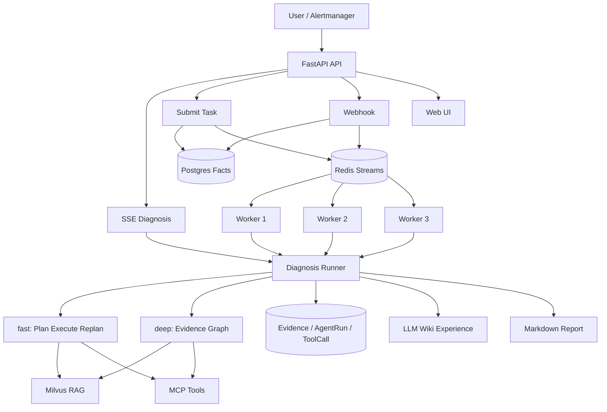

# 多智能体协同高校全专业个性化导学与资源生成平台（）

> **赛题**: 多智能体协同高校全专业个性化导学与资源生成平台
> **架构**: LangGraph 多智能体编排 + RAG + MCP + SSE 流式
> **场景**: 🎓 高等教育智能导学 — 6 个 AI Agent 协同打造个性化学习体验

基于 LangGraph 确定性编排的**高校智能导学平台**，6 个教育 Agent（画像分析 / 知识解析 / 资源生成 / 路径规划 / 智能辅导 / 学习评估）通过 fan-out 并行协作，为学生生成个性化学习资源、规划学习路径、提供智能辅导答疑。集成 RAG 知识库检索、SSE 流式输出，支持课程管理、学习日历、同学协作等完整校园场景。

[项目视频](https://www.bilibili.com/video/BV182RCBGEod/)


## 项目亮点

- **6 Agent 协作导学**：画像分析 → 知识解析 → 资源生成（文档/PPT/习题/视频/代码）→ 路径规划 → 智能辅导 → 学习评估，fan-out 并行执行
- **学情智能分析**：输入学习困扰，AI 多维度诊断薄弱环节，生成个性化改进方案
- **RAG 知识库增强**：Parent-Child chunking、Vector + BM25 混合检索、RRF 融合、本地 rerank，精准召回课程知识
- **SSE 流式输出**：Agent 产出实时推送，学习报告逐步呈现
- **完整校园场景**：课程管理、学习日历、同学协作、智能答疑、知识百科一站式平台
- **校园知识库**：支持上传课程笔记、教材资料，自动向量化索引，精准问答
- **可量化评测**：内置 50 题检索评测、50 题 RAGAS / OpenEvals 端到端评测和并发压测脚本。

## 架构概览



## 平台功能

### 🎓 智能导学（核心）
6 个 AI Agent fan-out 并行协作，输入学习需求后自动生成个性化学习方案：
- **📊 画像分析** — 分析学生知识基础、认知风格、学习目标
- **📚 知识解析** — 分解课程知识点树，关联前置和进阶内容
- **🎯 资源生成** — 生成文档/PPT大纲/习题/视频脚本/代码案例等 8 类资源
- **🛤️ 路径规划** — 制定分阶段学习路径，含周计划和里程碑
- **💡 智能辅导** — 概念解释、作业辅导、考试复习
- **📈 学习评估** — 掌握度、薄弱点、GPA 预测

### 📊 学情分析
描述学习困扰 → 多 Agent 分析薄弱环节 → 给出针对性改进方案

### 📚 我的课程
课程 CRUD 管理，进度追踪，一键跳转智能导学

### 📅 学习日历
动态月历，学习事件管理，考试/作业截止提醒

### 👥 同学协作
学习小组、讨论发布、学习伙伴匹配

### 💬 智能答疑
RAG 增强的知识库问答，流式 SSE 输出，支持联网搜索

### 📖 知识库
课程资料/笔记上传，自动向量化索引，精准检索

## 快速开始

### 1. 准备环境

需要：

- Python 3.11+
- Docker / Docker Compose
- 一个 OpenAI-compatible Chat 模型 API Key，例如 DeepSeek 或 DashScope
- 如使用本地 embedding，需准备 Ollama 和 `bge-m3`

```bash
git clone <your-repo-url>
cd <repo>
python -m venv .venv
source .venv/bin/activate
pip install -r requirements.txt
cp .env.example .env
```

编辑 `.env`，至少配置一个可用模型：

```env
DEEPSEEK_API_KEY=your-deepseek-api-key
# 或
DASHSCOPE_API_KEY=your-dashscope-api-key

KB_ADMIN_TOKEN=change-this-admin-token
```

### 2. 启动基础设施

```bash
docker compose up -d
```

这会启动 Milvus、Redis、Postgres、Attu 和 open-webSearch。

### 3. 导入知识库

```bash
python scripts/ingest_kb_corpus.py --dry-run
python scripts/ingest_kb_corpus.py --reset
```

如需重新生成 Prometheus 告警语料：

```bash
powershell -ExecutionPolicy Bypass -File scripts/fetch_kb_corpus.ps1
python scripts/convert_prometheus_alerts.py
```

### 4. 启动应用

macOS / Linux：

```bash
bash scripts/run_all.sh
```

Windows PowerShell：

```powershell
powershell -NoProfile -ExecutionPolicy Bypass -File .\run.ps1
```

容器化启动 API + Worker：

```bash
docker compose --profile app up -d --build
```

停止本地脚本启动的服务：

```bash
bash scripts/stop_all.sh
```

## 访问地址

| 页面 | 地址 |
|---|---|
| Web UI | http://localhost:9900 |
| Swagger | http://localhost:9900/docs |
| ReDoc | http://localhost:9900/redoc |
| 健康检查 | http://localhost:9900/api/v1/health |
| 就绪检查 | http://localhost:9900/api/v1/health/ready |
| 队列状态 | http://localhost:9900/api/v1/queue/status |
| Attu Milvus UI | http://localhost:8000 |

## 使用示例

本机诊断：

```text
我电脑很卡，帮我看下是不是 CPU 或内存太高
```

Redis 告警诊断：

```text
Redis 实例 redis-master-01 内存使用率 98%，客户端连接被强制断开
```

Alertmanager Webhook 模拟：

```bash
python scripts/mock_alert.py --scenario redis
python scripts/mock_alert.py --list-history
```

并发压测：

```bash
python scripts/loadtest.py submit --n 100 --concurrency 20
python scripts/loadtest.py webhook --n 500 --concurrency 100
```

## API 概览

| 功能 | 方法 | 路径 |
|---|---|---|
| AIOps 诊断，SSE | POST | `/api/v1/aiops/diagnose` |
| 后台诊断提交 | POST | `/api/v1/aiops/diagnose/submit` |
| 队列状态 | GET | `/api/v1/queue/status` |
| Alertmanager Webhook | POST | `/api/v1/webhook/alertmanager` |
| RAG Chat | POST | `/api/v1/chat/stream` |
| Skill 列表 | GET | `/api/v1/skills` |
| 上传文档 | POST | `/api/v1/documents/upload` |
| 文档列表 | GET | `/api/v1/documents` |
| 删除文档 | DELETE | `/api/v1/documents/{source}` |
| 健康检查 | GET | `/api/v1/health` |
| 就绪检查 | GET | `/api/v1/health/ready` |

知识库上传和删除需要请求头：

```http
X-KB-Admin-Token: your-admin-token
```

## 项目结构

```text
.
├── app/                    # FastAPI / Agent / RAG / Skill 核心代码
├── benchmark/              # 检索与 RAGAS 评测集、评测脚本、汇总报告
├── data/kb_corpus/         # RAG 开源语料
├── data/wiki/              # 运行时经验 Wiki 模板；诊断流水不提交
├── docs/sop/               # Redis / MySQL / 通用告警 SOP
├── frontend/               # Web UI
├── mcp_servers/            # MCP 工具服务
├── open-webSearch-main/    # 本地联网搜索服务
├── scripts/                # 启动、导入、压测和告警模拟脚本
├── docker-compose.yml
├── Dockerfile
├── requirements.txt
└── run.ps1
```

## 数据与隐私

仓库保留源码、文档、公开语料和 benchmark 记录。以下内容不应提交：

- `.env`、`.env.*` 中的 API Key 和本地配置
- `volumes/`、数据库卷、Redis / Milvus / MinIO 本地状态
- `data/wiki/index.md`、`data/wiki/log.md`、`data/wiki/services/`、`data/wiki/patterns/` 等运行时诊断经验
- `.idea/`、`.vscode/`、`.claude/`、`__pycache__/`、日志和临时文件

## 版本演进

README 保留这部分，是为了说明当前仓库为什么叫 V3，以及 V3 相比早期版本多了哪些工程能力。

### 基础诊断链路

早期版本聚焦单次诊断：用户输入故障描述后，系统在一次请求内完成 Skill Router、Planner、Executor、Replanner 和 Report。这个版本已经具备可演示的 AIOps Agent 闭环，但任务持久化、后台消费、证据审计和高并发能力较弱。

### V2：AgentHarness 与本地 WebSearch

V2 没有改变主流程拓扑，重点是把分散在各模块里的 prompt、模型选择、预算统计、降级和 reroute 策略收敛到 `app/runtime/agent_harness.py`。这样 Router、Planner、Executor、Replanner、Report、RAG Chat 等阶段可以统一管理模型和运行策略。

V2 同时把联网搜索从外部 Tavily 依赖切换为本地 [open-webSearch](https://github.com/Aas-ee/open-webSearch) daemon，并接入 Docker Compose 和启动脚本，减少对额外搜索 API Key 的依赖。

### V3：后台化、审计和评测

V3 是当前主版本，主要增强点包括：

- **双诊断模式**：`fast` 负责快速诊断，`deep` 负责多 Agent 证据归并和 RCA。
- **任务后台化**：`/api/v1/aiops/diagnose/submit` 提交任务，Redis Streams 排队，Worker 后台消费。
- **事实库审计**：Postgres 保存 alerts、incident groups、diagnosis tasks、agent runs、tool calls、evidence 和 reports。
- **事件工作台**：前端增加事件中心、任务详情、队列状态、证据链、审批浮层和评测报告。
- **权限边界**：默认只读诊断，高风险操作通过 permission mode 和 approval requests 留出人工确认入口。
- **经验沉淀**：`app/wiki/` 使用轻量 LLM Wiki，把诊断结果合并为 Markdown 经验页；运行时内容不提交到仓库。
- **检索评测**：`benchmark/` 保留检索侧 Recall@K、端到端 RAGAS / OpenEvals 数据和汇总报告。
- **并发测试**：`scripts/loadtest.py` 和 `docs/CONCURRENCY_TEST_GUIDE.md` 覆盖 submit、webhook、队列 backlog、pending、DLQ 和限流验证。

### V3 保留与取舍

V3 继续保留 Skill-first 思想、Plan-Execute-Replan 主链路、MCP 工具协议、Parent-Child RAG 和 Milvus 检索底座。相比更重的知识图谱或自动生成 Skill 方案，当前版本更偏向“可运行、可观测、可评测”的工程落地：先把诊断任务跑稳、把证据留住、把效果量化，再继续扩展更多数据源和自动处置能力。

## License 与来源

本项目代码以 **MIT License** 发布。

项目集成或参考了以下第三方开源资产，公开发布时请遵守各自的许可与署名要求：

- [Aas-ee/open-webSearch](https://github.com/Aas-ee/open-webSearch)：本地联网搜索 daemon，本仓库副本位于 `open-webSearch-main/`。
- [samber/awesome-prometheus-alerts](https://github.com/samber/awesome-prometheus-alerts)：Prometheus 告警语料来源，原始内容遵循 CC BY 4.0。
- 小林 OnCall Agent 项目：参考 OnCall Agent 场景设计、诊断流程和项目表达方式。
